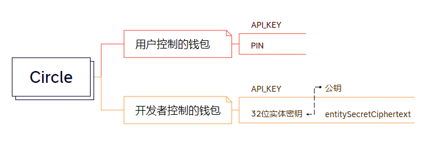

# 基于 Circle 可编程钱包 的 API安全加固方案

## 引言

在数字货币和去中心化金融迅速发展的今天，Web3 项目正成为金融科技创新的前沿阵地。

Web3，作为区块链技术的一种应用形式，其核心在于构建一个去中心化的网络与应用生态，而在这个生态中，数字钱包扮演着至关重要的角色。数字钱包不仅仅是用户进行数字货币交易的媒介，更是其个人财产安全的守门人。随着资产数字化转型的步伐加快，钱包掌握的不仅仅是交易权限，更扩展到身份认证、资产管理等领域。因此，它的安全性直接关联到整个Web3金融生态的稳定与信任。

在当前的Web3金融项目中，我们可以看到一系列通过智能合约来实现的复杂金融操作。而在 Circle 中所有这些操作的执行，都依赖于数字钱包与之相连接的APIs。APIs的安全性成为确保资金安全、维护用户信任、防范黑客攻击的第一道防线。

Circle可编程钱包拥有强大的功能和灵活的可编程特性，相信其能够在市场上获得广泛的应用。然而，在其普及程度的提高之前，对其安全的调控也不可或缺，尤其是API密钥的管理与保护问题，成为了我们亟需解决的重点问题。

针对这一背景，我们启动了这个项目，旨在通过构建一个针对Circle可编程钱包的API密钥的安全加固方案，以提升整个Web3金融项目的安全性。我们的目标是通过最新的安全技术和最佳实践，确保API密钥的生成、存储、使用和废止等生命周期的每一个环节都达到最高安全标准，从而确保用户资产的安全和项目的长期可持续发展。

## Circle钱包API概述

### Circle API 安全机制概述

**Reference**：https://developers.circle.com/w3s/reference/

这里重点讨论API中涉及到的身份认证参数。

通过阅读官方的API文档，可知 Circle 的API 都以 **API Key** 放于header 作为一些操作 **唯一** 的身份校验凭证。

```bash
  curl --request Method \
  --url APIurl \
  --header 'Authorization: Bearer <YOUR_API_KEY>' \
```

对于开发者控制的钱包 和 用户控制的钱包 两者，独立有两套身份验证：

对**用户**来讲，所有上游的敏感操作 比如交易，都是 " **transfer** " 即**质询**，需要在APP上使用**PIN**进行额外确认。

对于**开发者**来讲，所有的敏感操作都需要使用独立生成的 **32位实体密钥** 计算得到的 **entitySecretCiphertext。**



+ 所有 API 均基于HTTPS 协议传输。
+ API 具有基础权限管理，同时有 IP AllowList 白名单验证。
+ PIN码的处理都基于SDK，而SDK基于 Wrapper 构建，并不开源，确保开发者无法直接得知用户的PIN码。
+ **entitySecretCiphertext** 基于独立生成 **32位实体密钥 ，**并且 **entitySecretCiphertext** 的生成使用了PKCS1_OEAP 随机填充方案，使得即便是同一份数据每次加密后的结果也会不同，极大降低了被明文攻击的风险。
+ 根据 欧盟通用数据保护条例(GDPR) 所有的交易和API调用都有记录，不过这个属于常规没什么可提的。

### 安全风险分析

#### API_KEY

虽然 API_KEY，和 API 均基于HTTPS 协议传输，但是 API_KEY 确实出现在了传输过程中，HTTPS确实足够的安全，但作为Web3的金融应用，将数据安全性全部压在HTTPS上，并不是一个很认可的行为。

所以针对 API_KEY 我们做的加固则是让他只作为计算的一环出现，不体现在传输过程中。

APIKEY的权限，虽然有权限控制，但是并不精细，所以总体下来，使用签名代替直接传输是很必要的。

目前API_KEY格式如下：

```Python
TEST_API_KEY:7******************************c:8******************************3
{KEY_TYPE}:{KEY_ID}:{KEY_secret}
```

签名通过以下方式帮助保护请求：

+ 验证请求者的身份 

  签名确保请求是由持有有效访问密钥的人发送的.

+ 保护传输中的数据 

   为了防止请求在传输过程中被篡改，API 会使用请求参数来计算请求的哈希值，并将生成的哈希值加密后作为请求的一部分，发送到 API 服务器。 服务器会使用收到的请求参数以同样的过程计算哈希值，并验证请求中的哈希值。如果请求被篡改，将导致哈希值不一致，中心 API 将拒绝本次请求。

### 加固策略设计

#### Circle-HMAC-SHA256 签名

##### 公共参数

公共参数是用于标识用户和接口签名的参数，每次请求均需要携带这些参数，才能正常发起请求。

**Timestamp**

当前 UNIX 时间戳，精确到秒。注意，每次请求的所有时间戳要相同。

**Authorization**
HTTP 标准身份认证头部字段，即 Circle-HMAC-SHA256 的值。

##### 拼接请求字符串

```python
CircleRequest =
    HTTPRequestMethod + '\n' +
    CircleService + '\n' +
    CircleQueryString + '\n' +
    CircleHeaders + '\n' +
    SignedHeaders + '\n' +
    HashedRequestPayload
```

##### 请求方法

`HTTPRequestMethod`：请求的方法类型，如`GET`或`POST`。

##### 请求服务

`CircleService`：请求的具体服务，对于Circle API 比如对于API `https://api.circle.com/v1/w3s/users/token`则为 `/users/token`

##### 查询字符串

`CircleQueryString`：对于`POST`请求为空，对于`GET`请求则包含URL中的查询参数，如`?pageSize=10`。

##### 头部信息

`CircleHeaders`：需要参与签名的头部信息，至少包含 host 和 content-type 两个头部，也可加入其他头部参与签名以提高自身请求的唯一性和安全性。

 拼接规则：

 头部 key 和 value 统一转成小写，并去掉首尾空格，按照 `key:value\n` 格式拼接；

 多个头部，按照头部 key（小写）的 ASCII 升序进行拼接。

##### 签名头部

`SignedHeaders`：参与签名的头部字段名，如`content-type;host;`。

##### 请求载荷****哈希值****:**

`HashedRequestPayload`：对于`POST`请求，是请求体的SHA256哈希值；对于`GET`请求，通常为空字符串。

 计算方法：`Lowercase(HexEncode(Hash.SHA256(RequestPayload)))`

#### 拼接待签名字符串

```python
StringToSign =
    "Circle-HMAC-SHA256" + '\n' +
    RequestTimestamp + '\n' +
    CredentialScope + '\n' +
    SHA256(CircleRequest)
```

##### "Circle-HMAC-SHA256"

这部分是一个常量，表示使用的是Circle定制的HMAC-SHA256签名算法。

##### RequestTimestamp

这是发送API请求时的时间戳，取当前时间 UNIX 时间戳，精确到秒，注意要和请求头中的时间戳保持一致。

##### CredentialScope

这部分定义了签名的有效范围，它通常包含请求日期、目标服务和一个固定字符串（在这个例子中是"circle_request"），这样就将签名绑定到特定的服务和日期。格式通常是`YYYY-MM-DD/Service/circle_request`。

   +   `YYYY-MM-DD` 是请求日期，必须与`RequestTimestamp`中的日期一致。

   +   `Service` 是你正在请求的Circle API服务名称，需要去掉 "/" ，比如对于API "https://api.circle.com/v1/w3s/users/token" 则为 `userstoken` 。

   +   `circle_request` 终止字符串。

##### SHA256(CircleRequest)

1.  这是对`CircleRequest`字符串的SHA256散列值。

 `CircleRequest`包括了HTTP请求方法、请求服务、查询字符串、头部信息、签名头部以及请求载荷的散列值。

 将这些信息计算散列值，可以确保请求在传输过程中未被修改，并且签名仅对这个特定请求有效。

#### 计算签名密钥

对于 API_KEY ：**{KEY_TYPE}:{KEY_ID}:{KEY_secret}**

使用`KEY_secret`从API_KEY和`Date`计算`SecretDate`：

```python
SecretDate = HMAC_SHA256("Circle" + KEY_secret, Date)
```

使用`SecretDate`和服务名计算`SecretService`：

```python
SecretService = HMAC_SHA256(SecretDate, Service)
```

使用`SecretService`计算`SecretSigning`：

```python
SecretSigning = HMAC_SHA256(SecretService, "circle_request")
```

#### 计算签名

```python
Signature = HexEncode(HMAC_SHA256(SecretSigning, StringToSign))
```

#### 构造认证头部

```python
Authorization =
    "Circle-HMAC-SHA256" + ' ' +
    "Credential=" + KEY_ID + '/' + CredentialScope + ', ' +
    "SignedHeaders=" + SignedHeaders + ', ' +
    "Signature=" + Signature
```

- 使用`Authorization`头部在发起API请求时，将其添加到HTTP请求的头部信息中。

这套签名规范要求发送方在发起请求时提供由`KEY_secret`计算得出的签名，接收方（Circle API服务器）则可以使用相同的算法和发送方的`KEY_ID`来验证签名的有效性。这确保了请求的完整性和身份验证，同时避免了`KEY_secret`的直接传输。

#### 最终结果

`APIService` 请求的API对象，对于Circle API 比如对于API `https://api.circle.com/v1/w3s/users/token`则为 `/v1/w3s`

访问 url 为 `host` + `APIService` + `CircleService`

```bash
curl --request POST \
     --url Host+APIService+CircleService \
     --header 'Timestamp' \
     --header 'Authorization' \
     --header 'content-type: application/json' \
     --data '{"userId": "test_user"}'
```

#### 示例

比如，获取用户token。

```bash
curl --request POST \
     --url https://api.circle.com/v1/w3s/users/token \
     --header 'accept: application/json' \
     --header 'authorization: Bearer TEST_API_KEY:7e3ad84e7046d3c9a42e57ac5e65024c:88ab0846284532c3bab2a6d37974efd3' \
     --header 'content-type: application/json' \
     --data '
{
  "userId": "test_user"
}
'
```

在该签名验证下：

```bash
curl --request POST \
     --url https://api.circle.com/v1/w3s/users/token \
     --header 'Authorization: Circle-HMAC-SHA256 Credential=7e3ad84e7046d3c9a42e57ac5e65024c/2023-11-09/userstoken/circle_request, SignedHeaders=content-type;host, Signature=ae2684e8b60f1a15f25da453ff5f4309176338f8926bfa7d420a7b4e5cb5cfd7' \
     --header 'Content-Type: application/json; charset=utf-8' \
     --header 'Host: api.circle.com' \
     --data '
{"userId": "test_user"}
'
```

代码示例：

```python
# -*- coding: utf-8 -*-
import hashlib, hmac, json, os, sys, time
from datetime import datetime

# 密钥参数 推荐环境变量
# circle_api_key = os.environ.get("CIRCLE_API_KEY")
circle_api_key = "NEW_API_KEY:7e3ad84e7046d3c9a42e57ac5e65024c:8******************************3"
key_type, key_id, key_secret = circle_api_key.split(':')

host = "api.circle.com"  # Circle API的主机名 
APIService = "/v1/w3s"
CircleService = "/users/token"
endpoint = "https://" + host + APIService + CircleService

algorithm = "Circle-HMAC-SHA256"
timestamp = int(time.time())
date = datetime.utcfromtimestamp(timestamp).strftime("%Y-%m-%d")

params = {"userId": "test_user"}  # 根据实际API调用设置参数

# ************* 步骤 1：拼接规范请求串 *************
http_request_method = "POST"

CircleQueryString = ""
ct = "application/json; charset=utf-8"
payload = json.dumps(params)
CircleHeaders = "content-type:%s\nhost:%s\n" % (ct, host)
signed_headers = "content-type;host"
hashed_request_payload = hashlib.sha256(payload.encode("utf-8")).hexdigest()

CircleRequest = (http_request_method + "\n" +
                     CircleService+ "\n" +
                     CircleQueryString + "\n" +
                     CircleHeaders + "\n" +
                     signed_headers + "\n" +
                     hashed_request_payload)

print(f"CircleRequest:{CircleRequest}\n")

# ************* 步骤 2：拼接待签名字符串 *************
service = CircleService.replace("/", "")
credential_scope = date + "/" + service + "/" + "circle_request"

hashed_CircleRequest = hashlib.sha256(CircleRequest.encode("utf-8")).hexdigest()

string_to_sign = (algorithm + "\n" +
                  str(timestamp) + "\n" +
                  credential_scope + "\n" +
                  hashed_CircleRequest)
print(f"string_to_sign:{string_to_sign}\n")

# ************* 步骤 3：计算签名 *************

# 计算签名摘要函数
def sign(key, msg):
    return hmac.new(key, msg.encode("utf-8"), hashlib.sha256).digest()

# 根据Circle的API_KEY格式，这里使用key_secret部分进行签名
secret_date = sign(("Circle" + key_secret).encode("utf-8"), date)
secret_service = sign(secret_date, service)
secret_signing = sign(secret_service, "circle_request")
signature = hmac.new(secret_signing, string_to_sign.encode("utf-8"), hashlib.sha256).hexdigest()

print(f"signature:{signature}\n")

# ************* 步骤 4：拼接 Authorization *************
authorization = (algorithm + " " +
                 "Credential=" + key_id + "/" + credential_scope + ", " +
                 "SignedHeaders=" + signed_headers + ", " +
                 "Signature=" + signature)
print(f"authorization:{authorization}\n")

# 构建Curl命令
print(f"""curl --request POST \\
     --url {endpoint} \\
     --header 'Authorization: {authorization}' \\
     --header 'Content-Type: application/json; charset=utf-8' \\
     --header 'Host: {host}' \\
     --data '
{payload}
'""")
```